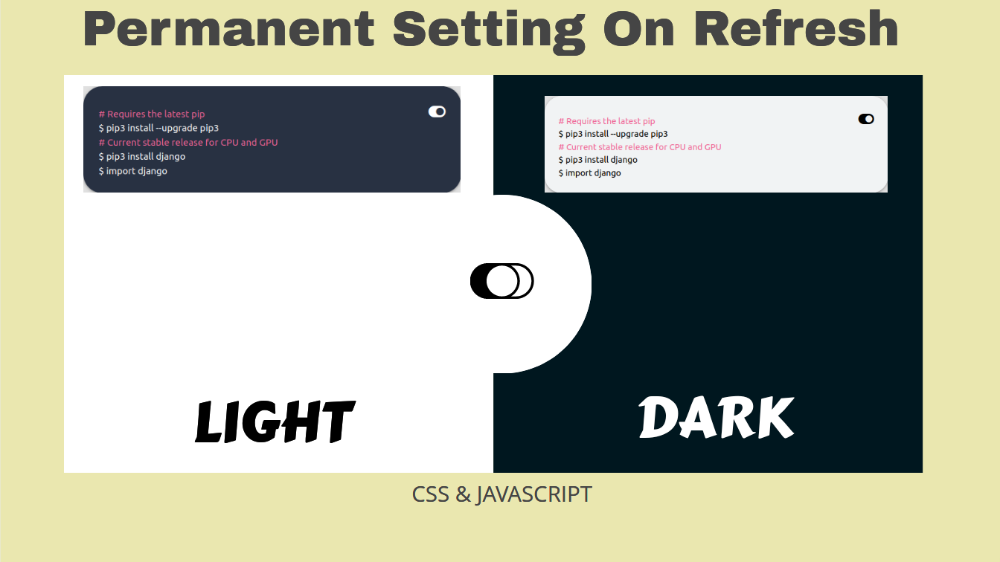
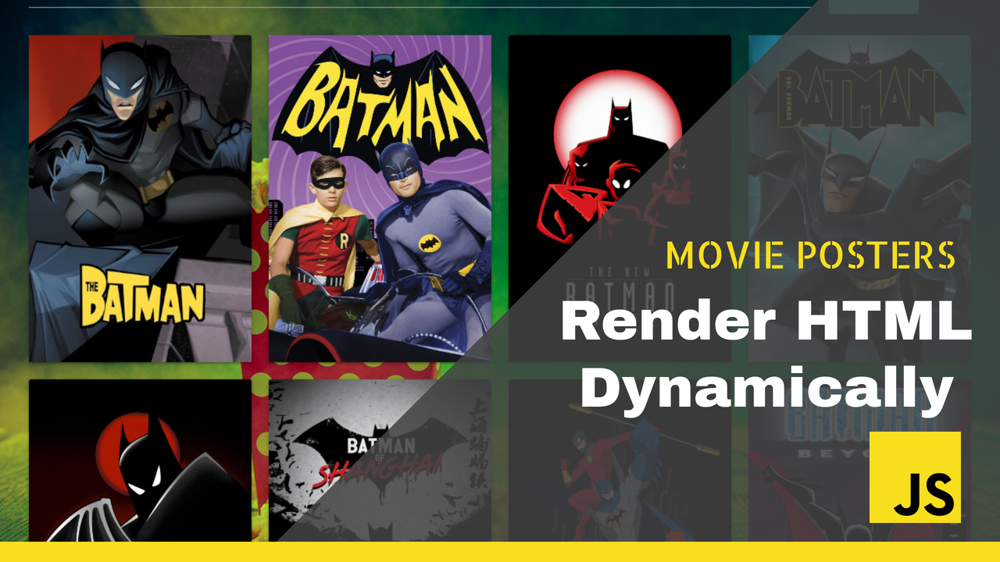

# DARK && lIGHT THEME TOGGLE PERMANENT SETTING

In this video will create a light,dark toggle effect with permanent setting.By permanent setting, I mean upon refreshing or closing the tab,the theme still remains as set.You can add this feature to your webpage projects as a bonus feature for your website visitors or audience.

This concept was inspired by the tensorflow documentation where you can toggle between the two themes on their code snippets.

So if you click on the toggle,you are switching between the themes.

My main aim is on the Javascript section,where will be utilising a simple concept.Keep watching to understand fully.

But first we will create the HTML boilerplate structure.

On our head we will add the fontawesome and materialize css cdn scripts.(IN DESCRIPTION)

Fontawesome is for the toggle image and materialize css is a styling bootstrap 

    <link rel="stylesheet" href="https://cdnjs.cloudflare.com/ajax/libs/materialize/1.0.0/css/materialize.min.css">

    

    

        

            

                

                  

                    

                          

                            

                              <h5 class="center-align">Dev Ngecu</h5>
                            

                            

                              

                                 <i onclick="myFunction()" id="toggle" class="fas fa-toggle-on"></i>
                                
# Requires the latest pip

                                
$ pip3 install --upgrade pip3

                                
# Current stable release for CPU and GPU

                                
$ pip3 install django

                                
$ import django

                              

                         
                            

                            
                          

                    

                  
                  

            
                

              

              

          

Styling 

    body{
            height: 100vh;
            width: 100%;
            transition: 3s ease;
            box-sizing: border-box;
        }
        .row{
        position: relative;
        height: 45%;
        }
        .card-content{
        position: relative;top: 40%;
        }
        .light-theme{
            color: black;
            transition: 3s;
            background-color: #F1F3F4;
        }
        .dark-theme {
        width: 100%;
            transition: 3s;
        background-color: #283142;
        color: white;
        }
        #comment{
            color: #f06292;
        }
        #toggle{
            float: right;
        }
        .card{
        height: 95vh;background-color: #EAE7AF;
        }

Now to the part that makes the difference,javascript.

The idea here is use of Web Storage API

What is the Web Storage API?

The Web Storage API is a set of mechanisms that enable browsers to store key/value pairs. It is designed to be much more intuitive than using cookies.

The key/value pairs represent storage objects, which are similar to objects except they remain intact during page loads, and are always strings. You can access these values like an object or using the getItem() method.

What is the difference between sessionStorage and localStorage?

The Web Storage API consists of two mechanisms: sessionStorage and localStorage. Both sessionStorage and localStorage maintain a separate storage area for each available origin for the duration of the page session.

The main difference between sessionStorage and localStorage is that sessionStorage only maintains a storage area while the browser is open (including when the page reloads or restores) while localStorage continues to store data after the browser is closed. In other words, whereas data stored in sessionStorage is cleared when the page is closed, data stored in localStorage does not expire.

In this tutorial, we’ll focus on how to use localStorage in JavaScript.
What is localStorage in JavaScript?

localStorage is a property that allows JavaScript sites and apps to save key/value pairs in a web browser with no expiration date. This means the data stored in the browser will persist even after the browser window is closed.

For a visual refresher on how to use localStorage in JavaScript, lets proceed:

We will first store the card in variable:
    const element=document.getElementById('card-theme');

Then define a function that will be called on clicking the toggle icon

    function myFunction() {
       

    if (element.classList.contains("dark-theme")) {
      element.classList.remove("dark-theme");
      element.classList.add("light-theme");
      localStorage.setItem("theme", "light-theme");

    }
    else{
    element.classList.remove("light-theme");
    element.classList.add("dark-theme");
        localStorage.setItem("theme", "dark-theme");

    }
    document.getElementById("currentTheme").innerHTML= localStorage.theme;

    }

element.classList.add(localStorage.theme);
document.getElementById("currentTheme").innerHTML= localStorage.theme;

# RENDER HTML DYNAMICALLY

## Dependencies

        <link rel="stylesheet" href="https://cdnjs.cloudflare.com/ajax/libs/materialize/1.0.0/css/materialize.min.css">

    <link rel="preconnect" href="https://fonts.gstatic.com">
    <link href="https://fonts.googleapis.com/css2?family=Oi&display=swap" rel="stylesheet">

    

    

...
    
    

        <nav>
            

                <a href="#"  class="brand-logo center">Movie Posters</a>

            

        </nav>

        

            

                

                    <input placeholder="Search" type="text" name="movie_search" id="movie_search">
                

                

                    <button class="btn waves-effect waves- btn-large" id="button">Search</button>
                

            

            

               
        

    

capture the required elements

    const button = document.getElementById('button');
    const row_body = document.getElementById('row-body');

add event listener on the search button
    
    button.addEventListener('click',async () =>{}

then define the function that will make the api calls

    async function fetchName() {
        let value = document.getElementById('movie_search').value;
        const response = await fetch(`http://api.tvmaze.com/search/shows?q=${value}`);
        shows = await response.json();
        return shows;
    }    

inside the 